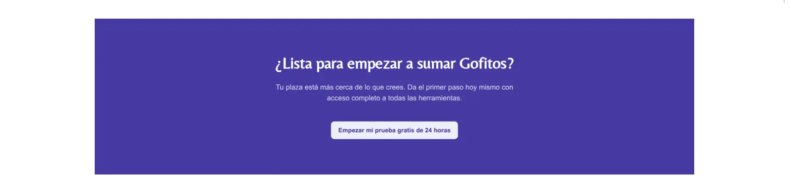

Use container in the main content of each section, to delimit a maximum width. 

In the project settings, the "container" class could already have some global configurations, like padding and margin

## Section without container 


## Section with container 

The content has a maximum width, even if the screen is very large. 

Also (if the class is already configured) the content is centered (automatic right and left margin)


<details>
<summary>Example code for the global container configuration</summary>

Example code for the global container configuration

Code added to the global project styles (additional to what tailwind offers by default).

**You don't need to add this code, the person who creates the base project will take care of it**

```css
/*src/styles/global.css*/
.container {
  margin: 0 auto; /*center content*/
  max-width: 1350px; /*maximum width*/
  padding: 4rem 1rem; /*padding around the content*/
}
```

</details>


### Code with container

```astro
// src/components/organisms/ejemplo.astro
---
// Components
import Card from "../atoms/Card.astro";

// Libs
import clsx from 'clsx'
---

<!-- 'container' class added to the parent of the main content (the section in this case) -->
<section class={clsx("container", "py-16", "md:py-24")}>
  <div
    class={clsx(
      "grid",
      "grid-cols-1 md:grid-cols-2",
      "gap-8 md:gap-12",
      "items-center",
      "px-0 md:px-4",
    )}
  >
    <div class={clsx("flex", "justify-center", "md:justify-end")}>
      
    </div>

    <div class={clsx("shadow-none")}>
      <Card title="Tu Objetivo es Nuestro Objetivo">
        <p class={clsx("mb-4", "text-neutral")}>
          ...
        </p>
      </Card>
    </div>
  </div>
</section>
```

> Learn more about how to style the components in [Components](../components/#styling-tailwind-classes)

## Full Width Sections

We can make full width sections and still use container to delimit the content

Example usage: a section that has to have a background color

### Original section with errors

The background does not cover the entire page width

```astro
// src/components/organisms/test.astro
---
// Components
import H2 from "../atoms/H2";
import ButtonLink from "../atoms/ButtonLink";

// Libs
import clsx from 'clsx'
---

<section class={clsx("hero", "bg-secondary", "text-secondary-content", "py-24")}>
  <div class={clsx("hero-content", "text-center")}>
    <div class={clsx("max-w-xl")}>
      <H2 className="!text-white">
        ¿Lista para empezar a sumar Gofitos?
      </H2>
      <p class={clsx("py-6")}>
        Tu plaza está más cerca de lo que crees. Da el primer paso hoy mismo con
        acceso completo a todas las herramientas.
      </p>
      <ButtonLink isSoft href="/#">
        Empezar mi prueba gratis de 24 horas
      </ButtonLink>
    </div>
  </div>
</section>
```



### Applying container

The background now covers the entire content, but does not overflow the maximum size

```astro
// src/components/organisms/test.astro
---
// Components
import H2 from "../atoms/H2";
import ButtonLink from "../atoms/ButtonLink";

// Libs
import clsx from 'clsx'
---

<!-- Main section without container: 'w-full' for full width -->
<section class={clsx("w-full", "hero", "bg-secondary", "text-secondary-content", "py-24")}>
  <!-- 'container' class used inside a div, to delimit the content -->
  <div class={clsx("container", "hero-content", "text-center")}>
    <div class={clsx("max-w-xl")}>
      <H2 className="!text-white">
        ¿Lista para empezar a sumar Gofitos?
      </H2>
      <p class={clsx("py-6")}>
        Tu plaza está más cerca de lo que crees. Da el primer paso hoy mismo con
        acceso completo a todas las herramientas.
      </p>
      <ButtonLink isSoft href="/#">
        Empezar mi prueba gratis de 24 horas
      </ButtonLink>
    </div>
  </div>
</section>
```


## Don't nest container inside other container

Be careful the containers: don't nest container inside other container, because it will break the layout.

```astro
---
// components/organisms/Features.astro

// Libs
import clsx from 'clsx'
---

<section class={clsx("container", "py-16", "md:py-24")}>
  <div class={clsx("grid", "grid-cols-1 md:grid-cols-2", "gap-8 md:gap-12", "items-center", "px-0 md:px-4")}>
    <div class={clsx("flex", "justify-center", "md:justify-end")}>
      
    </div>
  </div>
</section>
```


```astro
---
// pages/index.astro

// Components
import Layout from "../layouts/Layout.astro";
import Features from "../components/organisms/Features.astro";

// Libs
import clsx from 'clsx'
---

<Layout>

  <!-- Here is a div with container class -->
  <div class={clsx("container", "mx-auto", "px-4", "py-12")}>
    <h1>Hello World</h1>

    <!-- WRONG: this component already has a container class -->
    <!-- Cannot be nested inside other container -->
    <!-- <Features /> -->
  </div>

  <!-- Correct: no container class here -->
  <Features />
</Layout>
```
